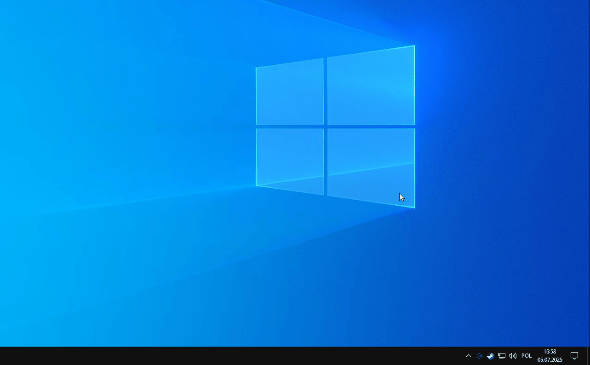

# nano-search

**nano-search** is a fast, background-based file indexing and search tool for Windows, built using WPF 
It indexes files on any specified drive from the configuration options and allows pattern-based file lookup using glob syntax or just simply search plain file names. Internally, it uses a **Radix Tree** for efficient storage and retrieval.

| Search Window                          | Tray Icon Interaction             |
|---------------------------------------|-----------------------------------|
|          |  |
> Click the images to view in full resolution.


## Features

- Index files(configurable) - by default searches only for `.exe`
- Search files using the Search Window by:
  - Exact filename (e.g., `myfile.exe`)
  - Glob patterns (e.g., `*.exe`, `myfile*.exe`)
- Showing the Search Window via an set hotkey
- Opening the file's directory in the File Explorer
- Launching the app either via left click or Enter key
- Navigating the search results via arrow keys
- Choosing which drives to index
- Fully configurable indexing options:
  - **File filters**:
    1. skip files starting with specific characters
    2. skip files based on file attributes
    <span id="inc3">3. *include* (not skip) a file that has the specified extension</span>
    4. skip files that does not meet the regex name pattern specified in the configuration file
    - The order of the applied filters are as above, a file is indexed once every filter hasn't skipped the file
  - **Directory filters**:
    1. basically the same as for files except it  skips commonly named directories(such as `System`) instead of point c) in [c)](#inc3)
- Configurable hotkeys for showing the Search Window
- Configurable hotkeys for navigating the search results
- Reindex the files again
- Toggle the tray icon
- Any of the settings may be restored to their default state
- Any error while executing those features will display an user-friendly notification

---

Why not use the NTFS Master File Table (MFT) to scan?
- it requires admin privileges
- works only for NTFS
- hard p/invoke implementatino ;C
- would need to fallback to standard win32 if NTFS is not available

## Building the Project

### Prerequisites

- [.NET SDK 8.0](https://dotnet.microsoft.com/en-us/download) or newer
- Windows OS (Win32 API dependency)
  ### Build Instructions

```bash
dotnet build nano-search.sln -c Release
```

##  Dependencies

This project uses the following libraries:

- [WPF UI](https://github.com/lepoco/wpfui) ([MIT License](https://github.com/lepoco/wpfui?tab=MIT-1-ov-file))
- [Dependency Injection](https://www.nuget.org/packages/Microsoft.Extensions.DependencyInjection)
  
Explorer Icon from [Flaticon](https://www.flaticon.com)

## License

This project is licensed under the [MIT License](./LICENSE).
